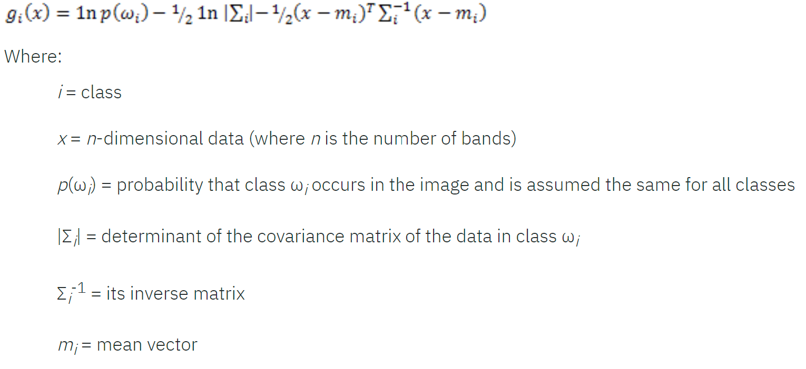
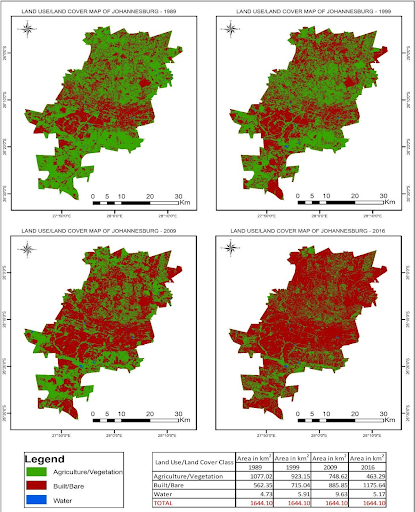

# Assignment 3 - Methods Paper

### Maximum Likelihood Supervised Classification for Analysis of Land Use and Land Cover Changes in Sub Saharan Africa

Noah Schulman - 1687 words

#### Land Use Changes in Sub Saharan Africa - Agricultural to Urban

It is widely acknowledged among experts that urbanization in developing countries often leads to poorly planned land use (Hatab et al., 2019). This is especially relevant in the context of Sub Saharan Africa, as it is the fastest urbanizing region in the world (Council on Foreign Relations, 2018). Many urban centers throughout Sub Saharan Africa are experiencing meteoric increases in population, creating a significant demand for residential and commercial building projects (Abass, Adanu & Agyemang, 2018). This leads to urban sprawl as land in the core of urban areas is far more expensive than rural/agricultural land in the periphery. Such urban sprawl has led to the loss of agricultural lands as developers and government officials place a higher value on more economically productive land such as residential or commercial building projects (Lasisi et al., 2017). Urban sprawl is an alarming development in the context of Sub Saharan Africa. Many Sub Saharan African countries have little arable land to begin with, and much of the agricultural land being destroyed near urban areas is the most agriculturally productive land in the region (Kiio & Achola, 2018). This is a dangerous trend that has been developing; urban areas in Sub Saharan Africa are seeing a tremendous increase in population, leading to an increased demand for food, however loss of agricultural lands puts a significant strain on the region’s food supply. If current trends continue, the supply of urban food systems in Sub Saharan Africa may not be able to keep up with increasing demands, and given a crisis situation, like a natural disaster or outbreak of war, such issues could be exacerbated, leading to large scale famine.

A process of this nature is difficult to observe and describe as each country has unique circumstances that affect this process in different ways. Due to the complex and multi-faceted nature of this process, it is important that modern data science methods are used to maximize efficiency and help identify patterns that would otherwise be difficult to observe. In this area of research, researchers commonly use Maximum Likelihood supervised classification to help observe land use and land cover changes over time. This method of classification allows for the accurate and efficient curation of land use land cover maps to evaluate changes in agricultural and urbanized land area over various time frames. Data from such land use land cover maps gives insight into ongoing trends relating to this development process and allows for a better understanding of the development problem as a whole. 

#### Central Research Question

The central research question I am focusing on in the context of this development problem is: How do current trends in urbanization affect food security in Sub Saharan Africa? This is a descriptive inquiry that seeks to identify what is happening through analyzing the causes and effects of this human development problem. My research can be broken down into several sub research questions. The first being: What factors influence urbanization in Sub Saharan Africa? This question is designed to identify and understand the causes of this development problem. The next sub research question seeks to identify and understand the effects of this development problem: To what extent is food security being strained in Sub Saharan Africa? The two aforementioned sub questions allow for a fuller understanding of my descriptive inquiry as they detail the causes and effects of this development process. My last sub question is: What data science methods can be used to analyze the intricacies of this human development problem? This question will help to explain the previous two questions in further detail while allowing for a better understanding of the complex nature of this process as a whole. 

#### Maximum Likelihood Supervised Classification

In my literature review exploring the scholarly articles investigating this human development process, I found that the researchers utilized the same procedure to analyze conversion of agricultural land into urbanized land in Sub Saharan Africa. The primary data science method used was Maximum Likelihood supervised classification. This method is designed to classify data in a given data set into various classes. The Maximum Likelihood formula is as follows (L3Harris Geospatial, 2018):

In traditional applications, this formula assumes that data for each class is normally distributed. The formula then decides which pixels are most likely to fall into a specific class. In the context of identifying land use and land cover changes, researchers utilize supervised classification. This means that the Maximum Likelihood classifier is trained using a pre-labeled data set. Researchers identifying land use and land cover changes in Sub Saharan Africa will typically classify multi-temporal geospatial imagery from various Landsat sensors (Landsat 5 TM, Landsat 7 ETM+, and Landsat 8 OLI) collected by the United States Geological Survey (Annobea & Simatele, 2018). The images then undergo various preprocessing procedures, such as radiometric and geometric corrections to eliminate any atmospheric distortions using a FLAASH module in the Environment for Visualizing Images (ENVI) software. In supervised classification, researchers manually identify which pixels in an image correspond with a specific class (Humboldt State University, 2015). For example, researchers would select pixels comprising an agricultural land area and classify them as agricultural land. Scholarly articles investigating land use and land cover changes in Sub Saharan Africa typically classify land into urbanized land, agricultural/vegetative land, bare land, and bodies of water. After the training sets have been manually classified, the Maximum Likelihood algorithm uses the classified data from the training sets to classify the rest of the images. In this classification process, the Maximum Likelihood algorithm, using information from the training set, will determine which pixels in the rest of the image are most likely to correspond with a specific class (ESRI, 2014). 

Once images have been classified, researchers will typically conduct an accuracy assessment to evaluate the veracity of their results (Abass, Adanu & Agyemang, 2018). Classified images are typically compared to images from Google Earth, where a GPS will randomly select a certain number of coordinates for image comparison. The researchers will then create a confusion matrix to evaluate the overall accuracy for each classification. 

After the Maximum Likelihood algorithm classifies the images, the classified data is then uploaded to a geographic information system (GIS), commonly ArcGIS, where land use land cover maps are created using the classified data (Lasisi et al., 2017). Land use land cover maps detail which regions of a geographic area fall into a specific land use or land cover class. This allows researchers to identify which areas of a region experience change in land use or land cover over a given time frame. In the context of land use changes in Sub Saharan Africa, land use land cover maps have identified a drastic reduction of agricultural land and a significant increase in urbanized land. 

The following are land use land cover maps from Annobea and Simatele’s (2018) investigation of Johannesburg, South Africa:

These land use land cover maps show a significant decrease in the agriculture/vegetation land class from 1989 to 2016. They also detail a drastic increase in the built/bare land class over the same time period, with the majority of the expansion replacing agricultural land. These findings are echoed in each of the articles I analyzed in my literature review of this development process in Sub Saharan Africa. Using Maximum Likelihood supervised classification, researchers were able to identify a general trend of significant reduction of agricultural land and dramatic increases of urbanized land in urbanizing regions of Sub Saharan Africa amidst a massive population boom. This allowed researchers to hypothesize that many regions of Sub Saharan Africa could experience serious problems regarding food security as urban food systems may not be able to keep up with increasing demands. 

#### Advantages of Maximum Likelihood Supervised Classification

Maximum Likelihood supervised classification is often selected as a means to classify images due to its user friendly nature and ability to be manipulated (Abass, Adanu & Agyemang, 2018). Researchers can easily train the algorithm using training sets and modify classes as needed. Utilization of a classifier such as Maximum Likelihood makes identification of land use and land cover changes far more efficient than traditional means. Manual classification of land areas as large as modern metropolitan areas would be a tremendously time and resource intensive task using traditional means of land class identification. The Maximum Likelihood algorithm can classify large land areas in a very short amount of time, allowing for researchers to take on analysis of sizable land areas. Data from Maximum Likelihood classification can also be uploaded to a geographic information system, such as ArcGIS, where land use land cover maps can be made to aid in analysis of land use and land cover changes over time. 

Maximum Likelihood classification helps to answer my central research question by giving insight into the causes and effects of my descriptive investigation. Land use land cover maps created using classified data show that urban centers of Sub Saharan African countries are experiencing very rapid levels of urban sprawl. This urban sprawl has led to a dramatic reduction in agricultural land. Based on this information, I can infer that the food supply for these individual cities is being significantly strained due to the sizable loss of agricultural land. This helps to answer my sub research question regarding the extent of food security being strained. Scholarly articles identifying this trend also note that this is occurring alongside an urban population boom, as exemplified by the rapid urban sprawl detailed in land use land cover maps. This suggests that food demand is also dramatically increasing, answering another one of my sub research questions regarding the causes of this development problem. I can also see how Maximum Likelihood supervised classification is an important data science method that allows researchers to observe this ongoing trend in a user friendly and efficient manner, helping me to understand which data science methods are effective in analyzing this type of development problem. Use of Maximum Likelihood supervised classification in analysis of this development problem allows for fuller understanding of my central research question and has answered many questions relating to my descriptive inquiry. 

#### Gap in Analysis

While Maximum Likelihood supervised classification allows for evaluation of how agricultural land area is decreasing, suggesting that food supply is decreasing, it is not able to quantify how the actual supply of food is changing. It is also not able to quantify how the demand for food is increasing as population increases. Other data science methods will have to be used to help fill in these gaps to allow for a fuller understanding of my central research question. 

#### References

Abass, K., Adanu, S. K., & Agyemang, S. (2018). Peri-urbanisation and loss of arable land in Kumasi Metropolis in three decades: Evidence from remote sensing image analysis. Land Use Policy, 72, 470-479. doi:10.1016/j.landusepol.2018.01.013

Annobea, E. M., & Simatele, D. (2018). Perspectives of the impact of urbanisation on urban agriculture landuse in Johannesburg, South Africa. University of the Witwatersrand, Johannesburg, 1-74.

Campbell, J. (2018, September 12). Africa is the Fastest Urbanizing Place on the Planet. Retrieved October 19, 2020, from https://www.cfr.org/blog/africa-fastest-urbanizing-place-planet

ESRI. (2014). How Maximum Likelihood Classification works. Retrieved November 12, 2020, from https://desktop.arcgis.com/en/arcmap/10.3/tools/spatial-analyst-toolbox/how-maximum-likelihood-classification-works.htm

Hatab, A. A., Cavinato, M. E., Lindemer, A., & Lagerkvist, C. (2019). Urban sprawl, food security and agricultural systems in developing countries: A systematic review of the literature. Cities, 94, 129-142. doi:10.1016/j.cities.2019.06.001

Humboldt State University. (2015). Supervised Classification. Retrieved November 12, 2020, from http://gsp.humboldt.edu/OLM/Courses/GSP_216_Online/lesson6-1/supervised.html

Kiio, M. M., & Achola, O. P. (2015). Land Use Land Cover Changes and their Effects on Agricultural Land: A Case Study of Kiambu County - Kenya. Kabarak Journal of Research & Innovation, 3(1), 1-13.

L3Harris Geospatial. (2018). Maximum Likelihood. Retrieved November 12, 2020, from https://www.l3harrisgeospatial.com/docs/MaximumLikelihood.html

Lasisi, M., Popoola, A., Adediji, A., Adedeji, O., & Babalola, K. (n.d.). City Expansion and Agricultural Land Loss within the Peri-Urban Area of Osun State, Nigeria. Ghana Journal of Geography, 9(3), 132-163.
